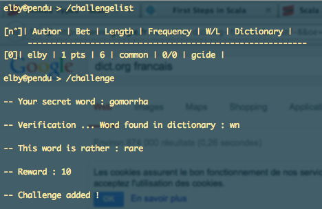
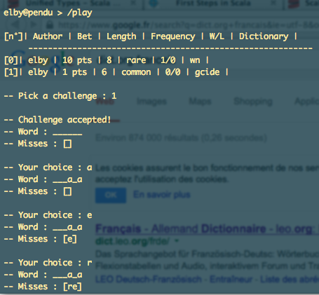
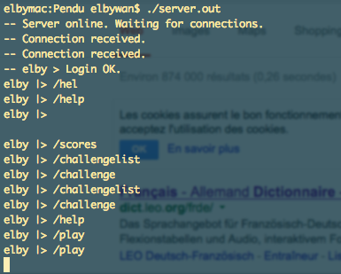

HANGMAN GAME
=============

This hangman game is an university project written in OCaml using the Light Weight Thread library.

Features :
- Hangman game with 6 tries
- Login / password server login (naïve)
- Scoreboard
- Word check in various dictionaries (dict.org)
- Word popularity check (on google)

How to run :
- Execute ./compile -server
- Run ./server.out
- Connect using telnet on port 15555 (default)

See README.TXT for more details in french language.

